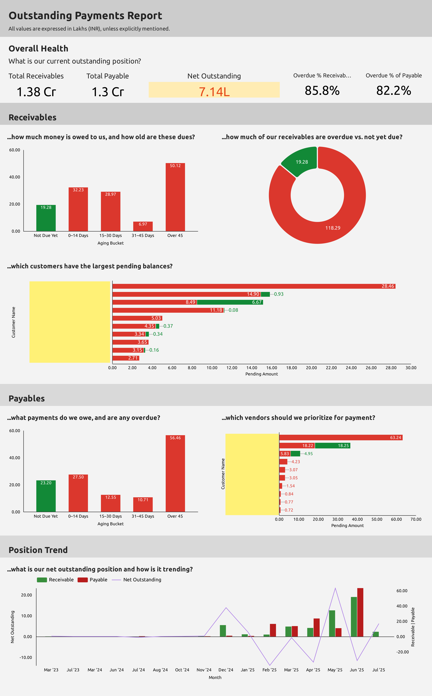

# 📊 Outstanding Payments Report

This project visualizes outstanding receivables and payables using data from Tally ERP stored in BigQuery and connected to **Looker Studio** for interactive reporting.

---

## 📁 Project Structure

````md
.
├── README.md
├── sql/
│   └── outstanding_payments_report.sql
├── docs/
│   └── metrics.md
├── assets/
│   └── report_screenshot.png
````

---

## 📌 Overview

This project answers:
- How much money is owed to us (receivables)?
- How much do we owe others (payables)?
- What is the aging status of these balances?
- What portion of our dues is overdue?
- Which customers/vendors have the largest outstanding?

The final report is available in Looker Studio and powered by a BigQuery SQL model.

> ⚠️ The visualization was built using [Looker Studio](https://lookerstudio.google.com/) with this query as the data source. The setup steps are straightforward, and not included in this repository.


---

## 🔗 Report Preview



> Note: Customer and vendor names in the report preview have been anonymized or hidden to maintain data confidentiality.


---

## 🔄 Data Pipeline

1. **Source**: Tally ERP data exported to BigQuery.
2. **Transformation**: SQL query calculates billed, adjusted, and outstanding amounts, aging buckets, and overdue status.
3. **Visualization**: Looker Studio dashboard built from query output.

---

## 📂 Main SQL Logic

You can find the full query here: [`sql/outstanding_payments_report.sql`](sql/outstanding_payments_report.sql)

Key transformations:
- Union opening balances and transactional bills.
- Separate new/advance vs. against reference entries.
- Calculate outstanding amount and overdue aging.
- Classify into aging buckets and status groups.

---

## 📈 Key Metrics

| Metric                        | Formula |
|------------------------------|---------|
| **Total Receivable**         | `SUM(IF(type='receivable',pending_amount,0))` |
| **Total Payables**           | `SUM(IF(type='payable',pending_amount,0))` |
| **Net Outstanding Position** | `SUM(CASE WHEN type = 'receivable' THEN pending_amount ELSE 0 END) + SUM(CASE WHEN type = 'payable' THEN pending_amount * -1 ELSE 0 END)` |
| **Overdue % Receivable**     | `ROUND(SUM(CASE WHEN type = 'receivable' AND overdue_by_days > 0 THEN ABS(pending_amount) ELSE 0 END) * 100 / NULLIF(SUM(ABS(pending_amount)), 0), 2)` |
| **Overdue % Payable**        | `ROUND(SUM(CASE WHEN type = 'payable' AND overdue_by_days > 0 THEN ABS(pending_amount) ELSE 0 END) * 100 / NULLIF(SUM(ABS(pending_amount)), 0), 2)` |
| **Overdue Receivables**      | `SUM(IF(type='receivable' AND overdue_by_days > 0, pending_amount, 0))` |
| **Overdue Payables**         | `SUM(IF(type='payable' AND overdue_by_days > 0, pending_amount, 0))` |

Detailed breakdown available in [`docs/metrics.md`](docs/metrics.md)

---

## 📅 Aging Buckets

| Bucket          | Days Overdue | Code |
|------------------|----------------|------|
| Not Due Yet       | < 0             | A1   |
| 0–14 Days         | 0–14            | A2   |
| 15–30 Days        | 15–30           | A3   |
| 31–45 Days        | 31–45           | A4   |
| Over 45 Days      | > 45            | A5   |

---

## 📌 Status Classification

| Status     | Logic                      |
|------------|----------------------------|
| Upcoming   | `overdue_by_days < 0`      |
| Due Today  | `overdue_by_days = 0`      |
| Overdue    | `overdue_by_days > 0`      |

---

## Credit

I would like to acknowledge and sincerely thank **[Dhananjay1405](https://github.com/dhananjay1405)** for providing the open-source [tally-database-loader](https://github.com/dhananjay1405/tally-database-loader) project. This tool has been instrumental in loading and querying Tally data efficiently. The project and associated SQL report scripts have greatly helped in building and analyzing the Tally database.

---

## 📬 Questions?

Feel free to open an issue or contact the maintainer if you have questions or want to contribute!

---
